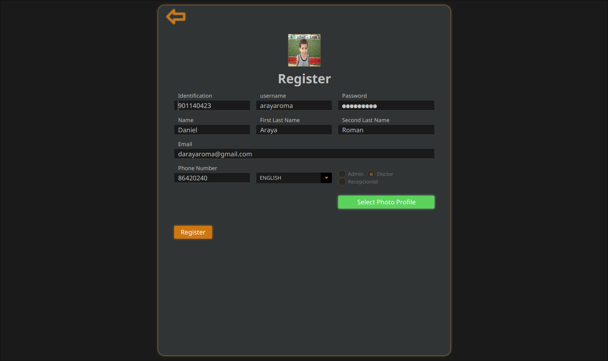
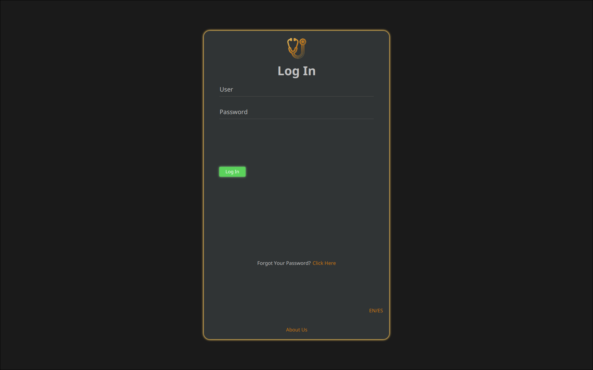
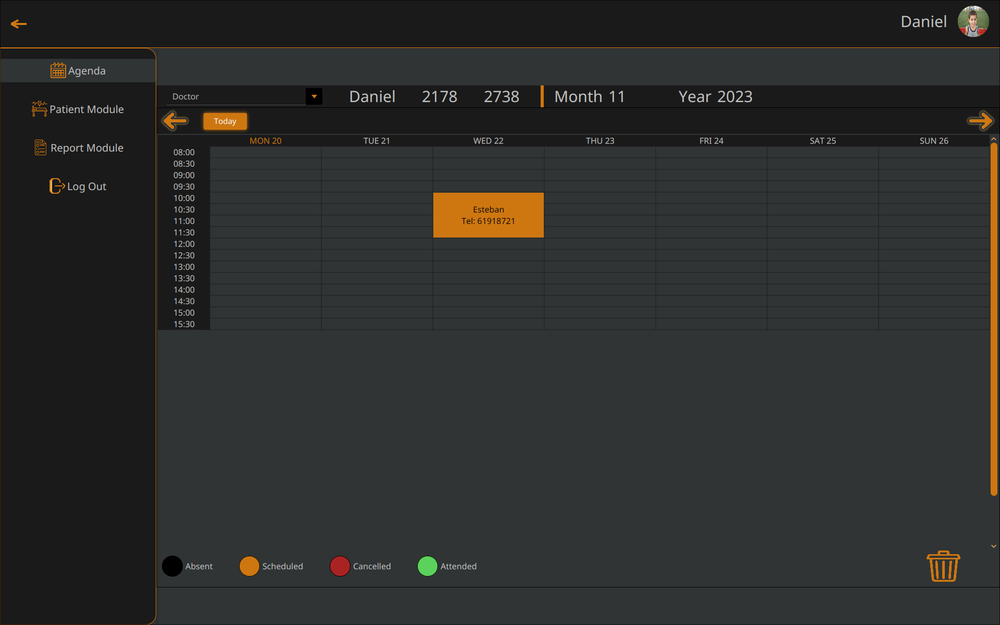
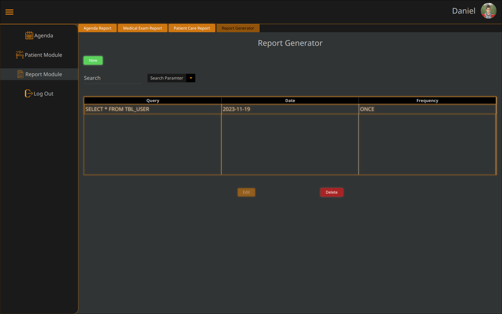
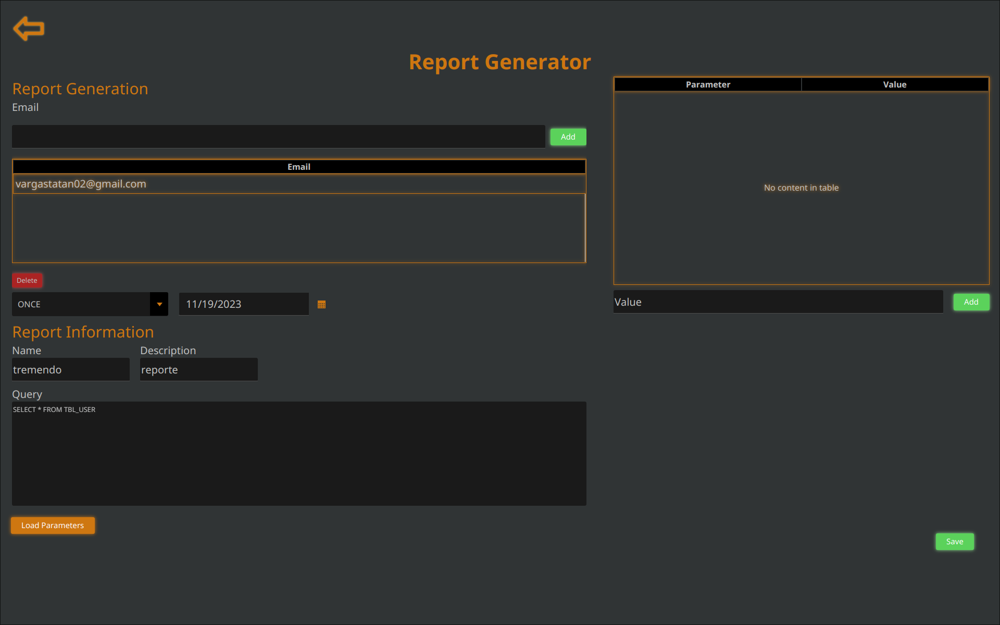
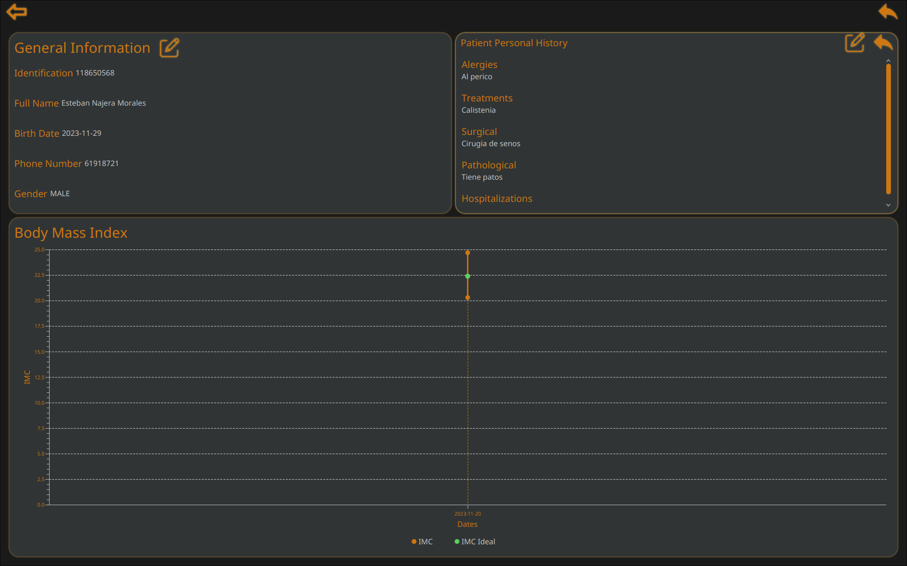
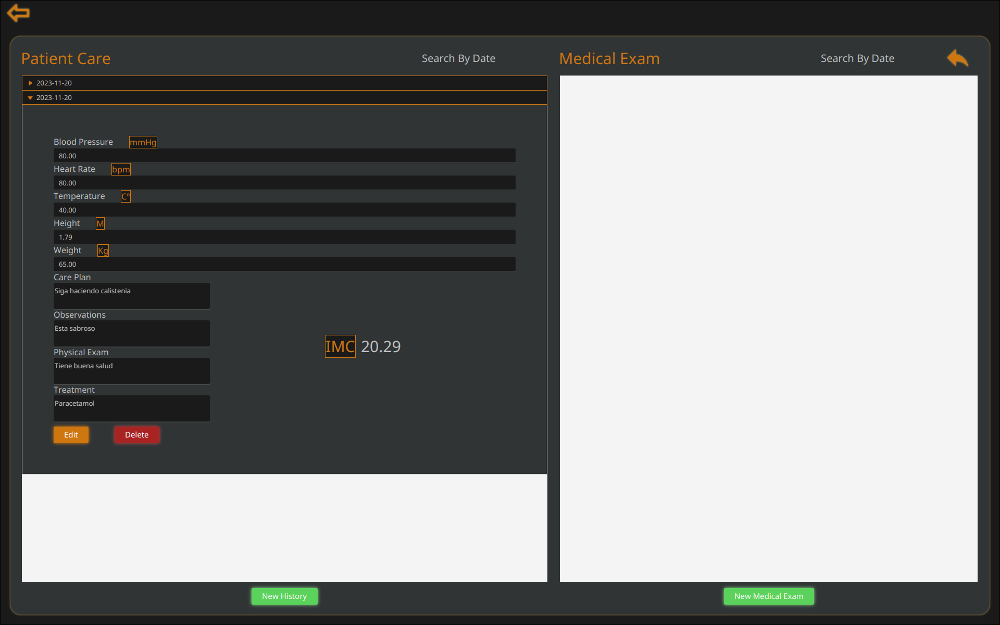
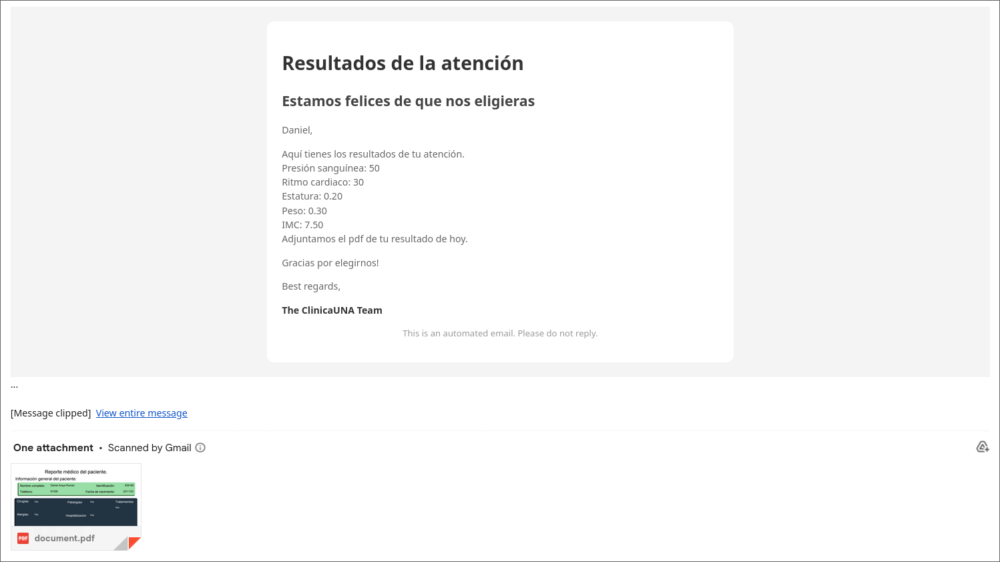

# proyecto-programacion-iii-2023

En este documento, encontrarán todas las indicaciones necesarias para llevar a cabo este proyecto de manera organizada y eficiente. Aquí se detallan las herramientas que utilizaremos, los procedimientos para trabajar con Docker, Git, Payara Server y Oracle Database 21c XE. Así como las convenciones que seguiremos para mantener un flujo de trabajo colaborativo y ordenado.

## Snapshots
### Vista Web

Vista general de la aplicación web. Disponible
en `http://localhost:8080/clinicaunaws/`.

### Registro de Usuarios




### Vista de la Agenda


### Módulo de Reportes




### Módulo de Pacientes




### Envío de correos



## Tabla de Contenidos
- [proyecto-programacion-iii-2023](#proyecto-programacion-iii-2023)
  - [Snapshots](#snapshots)
    - [Vista Web](#vista-web)
    - [Registro de Usuarios](#registro-de-usuarios)
    - [Vista de la Agenda](#vista-de-la-agenda)
    - [Módulo de Reportes](#módulo-de-reportes)
    - [Módulo de Pacientes](#módulo-de-pacientes)
    - [Envío de correos](#envío-de-correos)
  - [Tabla de Contenidos](#tabla-de-contenidos)
  - [Docker](#docker)
    - [Cómo levantar los contenedores](#cómo-levantar-los-contenedores)
    - [Oracle 21c XE Container](#oracle-21c-xe-container)
    - [Cómo levantar todos los contenedores del docker-compose](#cómo-levantar-todos-los-contenedores-del-docker-compose)
    - [Como detener los contenedores](#como-detener-los-contenedores)
    - [Como crear el esquema de la base de datos](#como-crear-el-esquema-de-la-base-de-datos)
  - [Git](#git)
    - [Convenciones](#convenciones)
      - [Commits:](#commits)
      - [Ramas principales:](#ramas-principales)
      - [Ramas temporales:](#ramas-temporales)
      - [Merge Conflicts:](#merge-conflicts)
  - [Payara Server](#payara-server)
    - [Cómo instalar Payara Server](#cómo-instalar-payara-server)
    - [Agregar Oracle JDBC Driver](#agregar-oracle-jdbc-driver)
    - [Cómo levantar Payara Server en Netbeans](#cómo-levantar-payara-server-en-netbeans)
    - [Cómo levantar Payara Server en modo debug](#cómo-levantar-payara-server-en-modo-debug)
    - [Cómo crear el JDBC Connection Pool](#cómo-crear-el-jdbc-connection-pool)
    - [Cómo crear el JDBC Resource](#cómo-crear-el-jdbc-resource)
    - [Cómo crear el JavaMail Session](#cómo-crear-el-javamail-session)
    - [Configuración de la sesión:](#configuración-de-la-sesión)
  - [Formato SQL para generar los reportes](#formato-sql-para-generar-los-reportes)
  - [Herramientas](#herramientas)

## Docker
### C&oacute;mo levantar los contenedores

### Oracle 21c XE Container
```docker
docker-compose start oracle 
```
&Uacute;nicamente se levantara el container de `oracle` 


### C&oacute;mo levantar todos los contenedores del docker-compose
```docker
docker-compose start
```

### Como detener los contenedores
```docker
docker-compose stop
```

### Como crear el esquema de la base de datos
```docker
docker exec oracle createAppUser ClinicaUNA una 
```

Esencialmente se utilizaran las siguientes im&aacute;genes:
- [Oracle 21c XE](https://hub.docker.com/r/gvenzl/oracle-xe)

## Git
Se estar&aacute; trabajando con un enfoque de ramas de corta y larga duraci&oacute;n. La primera para ramas temporales, que se vayan creando mientras se va desarrollando, la segunda para ramas principales.

### Convenciones


#### Commits:

Para el commit utilizaremos la siguiente convenci&oacute;n:
```
git commit -m "[<accion>] <seccion trabajada>" -m <mensaje breve/descriptivo>
```

Donde \<accion> puede ser:
- feat: Nueva funcionalidad
- fix: Correcci&oacute;n de errores
- add: Agregado de archivos
- remove: Eliminaci&oacute;n de archivos
- refactor: Refactorizaci&oacute;n de c&oacute;digo
- bug: Se introdujo un bug
- docs: Documentaci&oacute;n

Un ejemplo de un commit ser&iacute;a:
```
git commit -m "[feat] Login" -m "Se agrego la funcionalidad de login"
```

De esta manera cuando se verifique el log, se podr&aacute; ver de manera m&aacute;s clara que se hizo en cada commit.

#### Ramas principales:
Para las ramas de larga duraci&oacute;n, se utilizar&aacute; la siguiente convenci&oacute;n:
- master

La rama master ser&aacute; la rama principal, cualquier cambio que se agregue a esta rama, debe de ser aprobado por los dem&aacute;s miembros del equipo. Solo se debe de hacer merge a esta rama cuando se tenga una versi&oacute;n estable del proyecto.

- dev

La rama dev ser&aacute; la rama de desarrollo, se implementan las nuevas funcionalidades en esta rama. Cuando se tenga una versi&oacute;n estable, se hace merge a la rama master.

- test

La rama test ser&aacute; la rama de pruebas, se prueba el funcionamiento del c&oacute;digo en esta rama. Utilizando JUnit5 como framework de pruebas. 

#### Ramas temporales:
Para las ramas de corta duraci&oacute;n, se utilizar&aacute; la siguiente convenci&oacute;n:

- feature/\<nombre>

#### Merge Conflicts:
Para los merge coflicts, deben de estar al menos 2 personas presentes para resolverlos. Preferiblemente, se debe de resolver en conjunto con la persona que hizo el commit.

## Payara Server
### C&oacute;mo instalar Payara Server
Para instalar Payara Server, se debe de descargar el archivo zip de la p&aacute;gina oficial de [Payara](https://www.payara.fish/). Una vez descargado, se debe de descomprimir el archivo en la carpeta deseada.

### Agregar Oracle JDBC Driver
Para agregar el driver de Oracle, se debe descargar el archivo [ojdbc11.jar](https://download.oracle.com/otn-pub/otn_software/jdbc/233/ojdbc11.jar), a la carpeta `payara/glassfish/domains/domain1/lib/`. Una vez agregado, se debe de reiniciar el servidor.

### C&oacute;mo levantar Payara Server en Netbeans
Para levantar Payara Server en Netbeans, se debe de ir a la pesta&ntilde;a de `Services`, en la secci&oacute;n de `Servers`, dar click derecho, agregar servidor, seleccionar Payara Server, y seleccionar la carpeta donde se instal&oacute; Payara Server.

Luego, se debe de ir a la pesta&ntilde;a de `Services`, en la secci&oacute;n de `Servers`, dar click derecho, y seleccionar `Start`.

### C&oacute;mo levantar Payara Server en modo debug
Para levantar Payara Server en modo debug, se debe de ir a la pesta&ntilde;a de `Services`, en la secci&oacute;n de `Servers`, dar click derecho, y seleccionar `Start in debug mode`.

### C&oacute;mo crear el JDBC Connection Pool
Para crear el JDBC Connection Pool, se debe de ir a la pesta&ntilde;a de `Services`, en la secci&oacute;n de `Servers`, dar click derecho, y seleccionar `View Admin Console`. Una vez en la consola de administraci&oacute;n, se debe de ir a la secci&oacute;n de `Resources`, y seleccionar `JDBC`, luego seleccionar `JDBC Connection Pools`, y dar click en `New`.

En la secci&oacute;n de `General Settings`, se debe de agregar el nombre del pool (ClinicaPool), y seleccionar el recurso de tipo `javax.sql.PoolConnectionDataSource`. Luego dar click en `Next`.

En la secci&oacute;n de `Additional Properties`, se debe de dejar solo tres propiedades:
- User: `ClinicaUNA` 
- Password: `una`
- URL: `jdbc:oracle:thin:@localhost:1521/XEPDB1`

Luego dar click en `Finish`.

En general, volver y probar donde dice `Ping`, para verificar que el pool se haya creado correctamente.

### C&oacute;mo crear el JDBC Resource
Para crear el JDBC Resource, se debe de ir a la pesta&ntilde;a de `Services`, en la secci&oacute;n de `Servers`, dar click derecho, y seleccionar `View Admin Console`. Una vez en la consola de administraci&oacute;n, se debe de ir a la secci&oacute;n de `Resources`, y seleccionar `JDBC`, luego seleccionar `JDBC Resources`, y dar click en `New`.

En la secci&oacute;n de `General Settings`, se debe de agregar el nombre del pool (jdbc/Clinica), y seleccionar el pool creado anteriormente. Luego dar click en `OK`.

### C&oacute;mo crear el JavaMail Session
Para crear el JavaMail Session, se debe de ir a la pesta&ntilde;a de `Services`, en la secci&oacute;n de `Servers`, dar click derecho, y seleccionar `View Admin Console`. Una vez en la consola de administraci&oacute;n, se debe de ir a la secci&oacute;n de `Resources`, y seleccionar `JavaMail Sessions`, y dar click en `New`.

En la secci&oacute;n de `General Settings`, se debe de agregar el nombre de la sesi&oacute;n `mail/ClinicaMailSession`, y seleccionar el pool creado anteriormente. Luego dar click en `OK`.

### Configuraci&oacute;n de la sesi&oacute;n:
- Mail Host: `smtp.gmail.com`
- Default User: `clinicaunaws@gmail.com`
- Password: `aaxsmampvktmkput`
- Auth: `true`
- Default Sender Address: `clinicaunaws@gmail.com`
- mail.smtp.starttls.required: `true`
- mail.smtp.starttls.enable: `true`
- mail.smtp.port: `587`

## Formato SQL para generar los reportes
```sql
SELECT <value1>, <value2>, ... ,<valuen> 
FROM <TBL_table>
WHERE :value1 AND :value2 AND ... AND :valuen
```

Donde:
- No debe de llevar punto y coma al final `;`.
- Si se agregan cadenas de texto deben encerrarse los parametros entre comillas simples y no el valor

Ejemplo:
```sql
SELECT <value1>
FROM <TBL_table> 
WHERE ':value1' AND ':value2'
```

- No se debe de encerrar los valores entre comillas.
- Si se proporciona un Alias en la consulta entonces se va a reflejar el Alias. Sino se obtiene el parámetro indicado

Ejemplo de una consulta para obtener todas las citas del mes:

```sql
SELECT c.* 
FROM TBL_MEDICAL_APPOINTMENT c 
WHERE  c.SCHEDULEDDATE BETWEEN DATE ':fecha1' AND DATE ':fecha2'
```

Se sustituyen los parametros por el formato de fecha AAAA-MM-DD

- 2023-11-01
- 2023-11-30

## Herramientas
- [Docker](https://www.docker.com/)
- [Oracle Database 21c XE](https://www.oracle.com/database/technologies/xe-downloads.html)
- [Payara Server Docker Image](https://hub.docker.com/r/payara/server-full)
- [Git](https://git-scm.com/)
- [Oracle Database 21c XE Docker Image](https://hub.docker.com/r/gvenzl/oracle-xe)
- [Payara Server](https://www.payara.fish/)
- [Trello](https://trello.com/)

